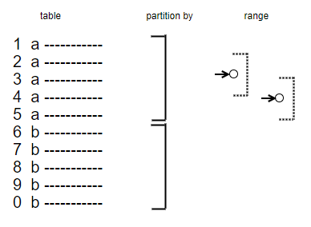

Since I use SQLs window function nearly on a daily basis. So there are a lot of introductions to this useful functionalty, that never got to the point IMHO. So I will try it better :). 

# Syntax

```sql
window_function (expression) OVER (
   [ PARTITION BY expr_list ]
   [ ORDER BY order_list ][ frame_clause ] ) 
```

> Note: a window function may only used in the **select** part of your statement and not in the other parts like **where**. It will evaluated **after** the your query has collected all rows, meaning, that every filter process, **where** expression and so on is finished.

```sql
select sum(my_value) over () from my_table
```

# Window Functions

As **window_function** (look at syntax) you can use some expressions, you already know from aggregate functions, like **sum, avg, min, max, ...**. And the **partition by** seems to somehow grouping your data. I think that is the reason, why the first understanding of window functions often is like: it is some kind of **group by** expression. This way of thinking prevents the real understanding of what these expressions really are. 

Lets come from the other side. Why are these functions called windows functions? 



You see in this picture the data rows of your **select** or **table**. Using the **partition by** clause you are able to split your data rows into partitions, sets, groups, you name it. But thats not all. The last but most important thing is the window, the frame or the look at this partition, that selects a part of this partition dependent of the current row (see the array to the dot) you are in, that is used to feed the **window_function**. This last part (IMHO) is the thing that gave those window functions its name. This range could be but doesn't need to be the whole partition. You are able to configure this window, but there are meaningfull default definitions of it.

# complete table processing

Let this be our little test table **test_table**.

|id|numvalue|
|--|----:|
|1|2|
|2|2|
|3|1|
|4|1|
|5|1|


Then this delivers the complete **sum** of **value** column but not in one row, instead of for each row of **mytable** the **sum** is delivered. 

```sql
SELECT id, sum(numvalue) OVER () AS mysum FROM mytable
```

And unlike **group by** aggregate expressions the result is not compressed.

|id|mysum|
|--|----:|
|1|7|
|2|7|
|3|7|
|4|7|
|5|7|


# with **partition by** only 

Now lets begin to partition our table **test_table**. For each distinct value of **numvalue** we want to **return** the maximum of **id**.

```sql
SELECT id, numvalue, MAX( id ) OVER ( PARTITION BY numvalue ) AS mymax FROM mytable
```

|id|numvalue|mymax|
|--|----:|-----:|
|1|**2**|2|
|2|**2**|2|
|3|1|5|
|4|1|5|
|5|1|5|

> Note: Without any further configuration the window function processes each row for every partition. Therefore the range is always to complete partition.

# with additional **order by**

Now the fun starts. Using an **order by** the window range within a partition is per default from the first row of the partition to the actual row regarding to the defined ordering. Now the **sum** delivers something completly different: it is a running sum. This is possible due to the ordering of the rows of a partition.

```sql
SELECT id, SUM( id ) OVER ( PARTITION BY numvalue ORDER BY id ) AS my_running_sum FROM mytable
```

|id|numvalue|my_running_sum|
|--|----:|-----:|
|1|**2**|1|
|2|**2**|3|
|3|1|3|
|4|1|7|
|5|1|12|

# Windows Functions

There is a huge set, dependent of the database system you are running on, which function you can use as **window_function**. Here is a subset of those:

window function|**order by** needed|description
---------------|-------------------|--------------------
avg | no | 
count | no, but possible | 


avg
count
Bsp with order by:
row_number, (Rechnungspositionen)
rank, dense_rank (equal values -> equal rank) (Rang von Dingen, siehe Siegertreppchen)
sum (again with order running sum) 
Laufende Summen in drei Datenbanken
Bsp with order by (access to other rows)
lead, lag (expr, [ offset, [ defaultvalue ] ]) 
vorher / nachher in drei Datenbanken
first_value, last_value, 

# with a **frame** definition
range definitions or frame definitions
rows
rows between unbounded preceding and unbounded following (alle)
rows between unbounded preceding and current row (std für order by)
rows between 2 preceding and 2 following
range
same as rows but only with values